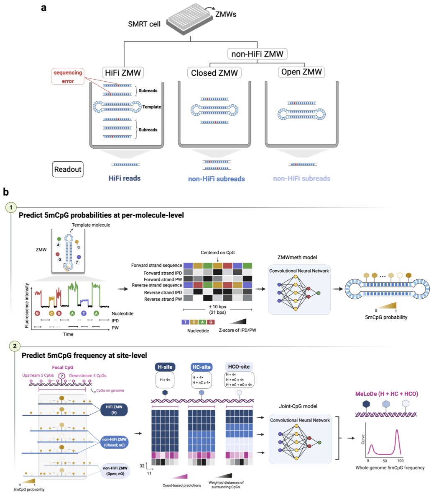

# MeLoDe
 **De**tect DNA **Me**thylaion from **Lo**w-depth long-read sequencing

## Installation

update **dir=/path/to/MeLoDe-Main** accordingly.

         git clone https://github.com/JavenCao/MeLoDe.git
         
         # (!!!please update!!!)
         dir=/path/to/MeLoDe-Main
         
         cd ${dir}
         sh install.sh
         export PATH=$PATH:${dir}/bin
         export LD_LIBRARY_PATH=${dir}/libtensorflow/lib:$LD_LIBRARY_PATH

## Workflow of MeLoDe in the low-depth long reads sequencing data

MeLoDe is developped to detect DNAm from PacBio low-depth long reads sequencing(LRS) data, which is an experimental design commonly used in population-scale study.

MeLoDe utilizes both **HiFi and non-HiFi molecules**. Below is the workflow to obtain the 5mCpG site-level methylation frequency from such data.

Raw data required: long reads sequencing data with subreads and kinetic signals avaliable (MeLoDe is versatile, and can be applied to HiFi reads directly, in case you don't have access to the subreads data, say, by Revio platform).

**Step1:** Synthesis HiFi reads from subreads: (**not MeLoDe step**)

        ccs --hifi-kinetics subreads.bam hifi.bam

**Step2:** Align HiFi reads and subreads to the reference genome, keeping fi/fp/ri/rp (HiFi reads) and ip/pw (subreads) tags: (**not MeLoDe step**)

        pbmm2 align --preset HiFi     Ref.fa hifi.bam      Aligned.hifi.bam
       
        pbmm2 align --preset SUBREAD  Ref.fa subreads.bam  Aligned.subreads.bam

**Step3:** Molecule-level 5mCpG probabilities:

Separately, for HiFi reads data and for subreads data, run the following command lines:

For HiFi reads data:

        MeLoDe_Read -bamfile Aligned.hifi.bam \
                    -InBamStatus aligned \
                    -readformat HIFI \
                    -outputType "MoleculeLevel" \
                    -outprefix "HiFi" \
                    -HDir /path/to/ZMWmeth_HiFi_model \
                    -Reference Ref.fa \
                    -Scale \
                    -Processor 10

-HDir is by default as: /path/to/MeLoDe-Main/Saved_model/ZMWmeth_HiFi_model/ds

"**HiFi.SingleMol.pre.txt**" will be generated, in which CpG sites captured by HiFi reads are predicted.

From subreads data:

        MeLoDe_Read -bamfile Aligned.subreads.bam \
                    -InBamStatus aligned \
                    -readformat SUBREAD \
                    -outputType "MoleculeLevel" \
                    -outprefix "Subread" \
                    -CDir /path/to/ZMWmeth_ClosedZMW_model \
                    -ODir /path/to/ZMWmeth_OpenZMW_model \
                    -Reference Ref.fa \
                    -Scale \
                    -Processor 10

-CDir is by default as: /path/to/MeLoDe-Main/Saved_model/ZMWmeth_Subreads_model/Closed-ZMW

-ODir is by default as: /path/to/MeLoDe-Main/Saved_model/ZMWmeth_Subreads_model/Open-ZMW

"**Subread.SingleMol.pre.txt**" will be generated, in which CpG sites captured by each molecule are predicted, using subreads as source data.

These molecule-level output files are tab-delimited in the following format:

        1. Chr: chromosome,
        2. Pos1: 1-based coordinate of the CpG on the reference genome
        3. ZMWid: molecule id from a SMRT cell
        4. ZMWtype: "H": HiFi reads, "C": Closed-ZMW, "O": Open-ZMW
        5. subdepth: subreads depth for the molecule
        6. Hap: haplotype, from HP tag
        7. HapBlk: haplotype black, fro PS tag
        8. strand
        9. y_pred: 5mCpG probability at the molecule-level
        10. y_pred_bi: methylation status, y_pred>0.5 -> 1; y_pred<0.5 -> 0

**Step4A:** CpG site-level DNA methylation frequency prediction (H_model):

        MeLoDe_HiFi -HiFiZMWpre HiFi.SingleMol_5mCpG.txt.gz \
                    -modelDir /path/to/H_model \
                    -outputfile Site-level

This step uses HiFi reads to predict the CpG site-level DNA methylation frequency.

"**Site-level.JointCpG.MeLoDe-HiFi.txt**" will be generated, in which only HiFi reads is used to predict CpG site-level methylation frequency.

**Step4B:** CpG site-level DNA methylation frequency prediction (HC and HCO model):

        MeLoDe_Combo -HiFiZMWpre HiFi.SingleMol_5mCpG.txt.gz \
                     -SubreadsZMWpre Subread.SingleMol_5mCpG.txt.gz \
                     -HCmodelDir /path/to/HC_model \
                     -HCOmodelDir /path/to/HCO_model \
                     -outputfile Site-level

This step jointly uses HiFi reads and non-HiFi molecules (automatically identified from SubreadsZMWpre) to predict the CpG site-level DNA methylation frequency.

The following two files will be generated:

"**Site-level.JointCpG.MeLoDe-Combo.HC.txt**"    : Jointly use HiFi reads(H) and non-HiFi-Closed-ZMW(C) to predict CpG site-level DNA methylation frequency

"**Site-level.JointCpG.MeLoDe-Combo.HCO.txt**"   : Jointly use HiFi reads(H), non-HiFi-Closed-ZMW(C) and non-HiFi-Open-ZMW(O) to predict CpG site-level DNA methylation frequency

These tab-delimited output files are in the following format:

        1. Chr: chromosome
        2. PosC: 1-based coordinate of the CpG on the reference genome
        3. molecule_cov: total read/molecule depths
        4. model_based: model-based prediction
        5. count_based: count-based prediction, methylated reads count / total reads count
        6. Me: methylated reads count
        7. unMeth: unmethylated reads count
        8. cisCpG_ave_weights: surroudning CpGs distance weights

**Step5:** Combine predictions from **Step4A** and **Step4B** to generate **MeLoDe(H)**, **MeLoDe(H+HC)** and **MeLoDe(H+HC+HCO)**:

        MeLoDe_Merge -Hfile Site-level.JointCpG.MeLoDe-HiFi.txt \
                     -HCfile Site-level.JointCpG.MeLoDe-Combo.HC.txt \
                     -HCOfile Site-level.JointCpG.MeLoDe-Combo.HCO.txt \
                     -outputfile Test

The following three files:

"**Test.MeLoDe_H.site.txt**"          :   incorporates predictions from H-sites only

"**Test.MeLoDe_H_HC.site.txt**"       :   combining H-sites and HC-sites predictions

"**Test.MeLoDe_H_HC_HCO.site.txt**"   :   integrating all three CpG groups

## MeLoDe on HiFi reads

If you only have HiFi reads (say, from Revio platform), MeLoDe is compatible with HiFi reads. Please follow the steps below:

**Step1: read-level 5mCpG prediction**

From **unaligned HiFi reads**:

        MeLoDe_Read -bamfile m64284e_230525_074225_hifi.bam \
                    -InBamStatus unaligned \
                    -readformat HIFI \
                    -outputType "ModBam" \
                    -outprefix Sample_Name \
                    -HDir /path/to/ZMWmeth_HiFi_model \
                    -Scale \
                    -Processor 10

-HDir is by default as: /path/to/MeLoDe-Main/Saved_model/ZMWmeth_HiFi_model/ds

"**Sample_Name.5mc.mod.unaligned.bam**" will be generated, in which the MM/ML tags are created, tagging the positions (MM) and 5mCpG probabilities (ML) of CpGs on each HiFi reads.

Adding "--KeepKinetics keep" will keep the fi/fp/ri/rp tags, otherwise removed.

**Step2: Alignment (not MeLoDe step)**

align the 5mCpG tagged ModBam file above to the reference genome using pbmm2:

        pbmm2 align --preset HiFi Ref.fa Sample_Name.5mc.mod.unaligned.bam Aligned_Sample_Name.5mc.mod.unaligned.bam

**Step3: CpG site-level 5mC frequency estimation**

Decode the mod.bam with MM/ML tag into read-level prediction:

        MeLoDe_TagExtract -bamfile Aligned_Sample_Name.5mc.mod.unaligned.bam \
                          -outfile Hpre.Read.level.meth.prob.txt.gz
        
        MeLoDe_HiFi -HiFiZMWpre HiFi.SingleMol_5mCpG.txt.gz \
                    -modelDir /path/to/H_model \
                    -outputfile Sample_Name
       
The tab-delimited output file of "**Sample_Name.JointCpG.MeLoDe-HiFi.txt.gz**" reports DNA 5mCpG methylation frequency on CpG sites.

## (Advanced) Model training

By default, MeLoDe uses the pre-trained models, which are released together with the software.

        .
        ├── JointCpG_model
        │   ├── H
        │   │   ├── assets
        │   │   ├── saved_model.pb
        │   │   └── variables
        │   │       ├── variables.data-00000-of-00001
        │   │       └── variables.index
        │   ├── HC
        │   │   ├── assets
        │   │   ├── saved_model.pb
        │   │   └── variables
        │   │       ├── variables.data-00000-of-00001
        │   │       └── variables.index
        │   └── HCO
        │       ├── assets
        │       ├── saved_model.pb
        │       └── variables
        │           ├── variables.data-00000-of-00001
        │           └── variables.index
        ├── ZMWmeth_HiFi_model
        │   ├── ds
        │   │   ├── assets
        │   │   ├── saved_model.pb
        │   │   └── variables
        │   │       ├── variables.data-00000-of-00001
        │   │       └── variables.index
        │   └── ss
        │       ├── assets
        │       ├── saved_model.pb
        │       └── variables
        │           ├── variables.data-00000-of-00001
        │           └── variables.index
        ├── ZMWmeth_Subreads_model
        │   ├── Closed-ZMW
        │   │   ├── assets
        │   │   ├── saved_model.pb
        │   │   └── variables
        │   │       ├── variables.data-00000-of-00001
        │   │       └── variables.index
        │   └── Open-ZMW
        │       ├── assets
        │       ├── saved_model.pb
        │       └── variables
        │           ├── variables.data-00000-of-00001
        │           └── variables.index
        └── model_training_scripts
        ├── readtrain.py
        ├── save_model.py
        ├── sitetrain.py
        ├── sitetrain_format_Combo.py
        └── sitetrain_format_HiFi.py

Users could train their own *ZMWmeth model* and *Joint-CpG model* to determine read-level 5mCpG status, and estimate site-level 5mCpG frequency, respectively.

Actually, not only 5mC modification, but other DNA/RNA modifications fit, as long as the training data can be properly generated

### Train ZMWmeth model

To train *ZMWmeth model*, ground-truth Fully-methylated sample and Fully-unmethylated sample are both needed.

In MeLoDe, when training ZMWmeth model for 5mCpG, datasets used included fully-methylated DNA samples created by treatment with CpG Methyltransferase M.SssI, and fully-unmethylated DNA samples generated by whole genome amplification.

And, ZMWmeth model can be trained using HiFi reads, or subreads, in double-strand or single-strand resolution.

Below, we show how the ZMWmeth-model (HiFi) model was trained.

**- Step1 - feature extration**

From **unaligned HiFi reads**, you get from the sequencing machine with fi/fp/ri/rp tags, such as a file like m64284e_230525_074225_hifi.bam

        MeLoDe_Read -bamfile m64284e_230525_074225_hifi.bam \
                    -InBamStatus unaligned \
                    -readformat HIFI \
                    -outputType "Feature" \
                    -outprefix Sample_Name \
                    -Scale \
                    -Processor 10

"Sample_Name.Kmat.txt.gz" will be generated, which stores HiFi read level features (tab-delimited), columns are as follows:

        1. "TOP": flag, suggesting it is from top_unaligned file
        2. zmwname: ZMWname, molecule id
        3. pos_on_read: CpG position on the molecule
        4. fn: subreads depth from forward strand, from fn tag
        5. rn: subreads depth from reverse strand, from rn tag
        6. Sequence context for top-strand on its template in 3'-5' direction
        7. IPD features when synthesizing the top-strand, "," split
        8. PW features when synthesizing the top-strand, "," split
        9. Sequence context for bot-strand on its template in 3'-5' direction
        10. IPD features when synthesizing the bot-strand, "," split
        11. PW features when synthesizing the bot-strand, "," split

**- Step2 - model training**

Features from **Fully-methylated** sample and **Fully-unmethylated** sample are both in need, as above.

Then, using these feature files at molecule-level, ZMWmeth model can then be trained as follows:

        python readtrain.py --MethFeature Me.Kmat.txt.gz \
                            --UnMethFeature UnMe.Kmat.txt.gz \
                            --OutDir /output/folder/

Specifically, training data can be pre-selected for customization. Such as:
* use HiFi reads or subreads features exclusively to train
* select reads/molecules located at CpG-Island/CpG-desert
* select CpGs at chromsome 10
* use 1 or multiple reads for each CpG
* use same number of reads from Fully-methylated sample and Fully-unmethylated sample
* merge multiple samples and/or species
* random select 10M reads
* ... ...

### Train Joint-CpG model

To train *Joint-CpG model*, wild-type samples with ground-truth site-level methylation frequency (such as determined by WGBS) are needed.

Joint-CpG model can be trained with respected to HiFi reads, and combination of HiFi-reads + nonHiFi-molecule with subreads.

Below, we show how the Joint-CpG model in MeLoDe-Combo was trained, which utilized both HiFi molecules in HiFi reads, and non-HiFi molecules in subreads.

**- Step1 - Single-molecule level 5mCpG identification**

On HiFi reads data:

        MeLoDe_Read -bamfile Aligned.hifi.bam \
                    -InBamStatus aligned \
                    -readformat HIFI \
                    -outputType "MoleculeLevel" \
                    -outprefix "HiFi" \
                    -HDir /path/to/ZMWmeth_HiFi_model \
                    -Reference Ref.fa \
                    -Scale \
                    -Processor 10

On subreads data:

        MeLoDe_Read -bamfile Aligned.subreads.bam \
                    -InBamStatus aligned \
                    -readformat SUBREAD \
                    -outputType "MoleculeLevel" \
                    -outprefix "Subread" \
                    -CDir /path/to/ZMWmeth_ClosedZMW_model \
                    -ODir /path/to/ZMWmeth_OpenZMW_model \
                    -Reference Ref.fa \
                    -Scale \
                    -Processor 10

By running these 2 commandlines, molecule-level 5mCpG predictions can be obtained, no matter the CpG site is captured by HiFi reads, or non-HiFi-molecule subreads, which are stored in the following two output files:

"HiFi.SingleMol_5mCpG.txt.gz": CpG sites captured by HiFi reads

"Subread.SingleMol_5mCpG.txt.gz": CpG sites captured by molecules, using subreads as source data.

**- Step2 - create CpG study-window for Joint-CpG model**

        python sitetrain_format_Combo.py -hifizmw HiFi.SingleMol_5mCpG.txt.gz \
                                         -subreadzmw Subread.SingleMol_5mCpG.txt.gz \
                                         -trueMe WGBS.cpg.txt \
                                         -maxCpGnum 1000 \
                                         -o Sample_CpG

Specifically, training data can be pre-selected for customization. Such as:
* Using CpG sites from chromosome 7
* Using CpG sites from CpG islands
* Using CpG sites with ground-truth methylation frequencies of 0-20
* Using CpG sites with or without inter-individual variations
* -exclude CpGs_exclude.list, each line is a CpG site to be exclued, in the format of chr_pos
* -include CpGs_include.list, each line is a CpG site to be included, in the format of chr_pos
* ... ...

**- Step3 - model training**

Put well-formatted CpG study-window into a .fofn (file of file names), such as:

        ls /path/to/Sample_CpG.*.npz > JointCpG.npz.fofn

        python sitetrain.py -npzl JointCpG.npz.fofn \
                            -r 5 \
                            -bz 5 \
                            -o /output/folder/

## Full parameter table

Usage of **MeLoDe_Read**:

        -bamfile string
                aligned/unaligned BAM file with kinetic signals, fi/fp/ri/rp for hifi reads, and ip/pw for subreads
        -InBamStatus string
                aligned or unaligned
        -readformat string
                read type, SUBREAD or HIFI (default "HIFI")
        -outputType string
                Output Types: ModBam,Feature,MoleculeLevel. ModBam: Modification Bam file. | Feature: Feature matrix. | MoleculeLevel: Molecule level modification prediction
        -outprefix string
                [*outprefix*].modification.bam for ModBam outputType.  [*outprefix*].Kmat.txt.gz for Feature outputType. [*outprefix*].SingleMol.pre.txt.gz for MoleculeLevel outputType

        -HDir string
                ZMWmeth-HiFi model directory, Saved_model/ZMWmeth_HiFi_model/ds
        -CDir string
                ZMWmeth-ClosedZMW model directory, Saved_model/ZMWmeth_Subreads_model/Closed-ZMW
        -ODir string
                ZMWmeth-OpenZMW model directory, Saved_model/ZMWmeth_Subreads_model/Open-ZMW

        -KeepKinetics string
                remove or keep. flag to indicate keep or remove the kinetic signals in the output Bam file (default "remove")
        -radius int
                cpg +/- r base pairs will be included in the read-level prediction (default 10)
        -minsubreadsdepth int
                min subreads depth for a ZMW to be included (default 1)
        -maxsubreadsdepth int
                max subreads depth for a ZMW to be excluded (default 60)
        -MappingQuality int
                min mapping quality for a read to be included (default 30)
        -Processor int
                Parallelism processors
        -Reference string
                The reference genome in fasta format when the input is an aligned bam
        -Scale
                flag to indicate scale the signal of each subreads, (x-mean)/std. Without this tag is raw signal value
        -Chromosome string
                processing chromosome (default "whole_genome")
        -cpuprofile string
                write cpu profile to this file
        -loglevel int
                0-debug,1-info,2-warn,3-error (default 1)
        -topN int
                just process top N rows

Usage of **MeLoDe_Combo**:

        -HiFiZMWpre string
                HiFi reads - single molecule level prediction. File format: txt.gz
        -SubreadsZMWpre string
                ZMW prediction using subreads. File format: txt.gz
        -cpuprofile string
                write cpu profile to this file
        -minZMWdepth int
                min ZMW_molecule/HiFi_reads/CCS_reads depth (default 4)
        -modelDir string
                Joint-CpG model directory for MeLoDe-Combo
        -outputfile string
                CpG site level methylation frequency
        -p int
                Parallelism processors
        -topN int
                just process top N rows
        -windowRadius int
                how many CpG sites in a sliding window? (2 * r + 1) (default 5)

Usage of **MeLoDe_HiFi**:

        -HiFiZMWpre string
                HiFi reads - single molecule level prediction. File format: txt.gz
        -cpuprofile string
                write cpu profile to this file
        -minZMWdepth int
                min ZMW_molecule/HiFi_reads/CCS_reads depth (default 4)
        -modelDir string
                Joint-CpG model directory for MeLoDe-Combo
        -outputfile string
                CpG site level methylation frequency
        -p int
                Parallelism processors
        -topN int
                just process top N rows
        -windowRadius int
                how many CpG sites in a sliding window? (2 * r + 1) (default 5)

Usage of **MeLoDe_TagExtract**:

        -bamfile string
                Aligned HiFi Bam file with MM/ML tags
        -cpuprofile string
                write cpu profile to this file
        -loglevel int
                0-debug,1-info,2-warn,3-error (default 1)
        -outfile string
                Read levle prediction file
        -topN int
                just process top N rows
